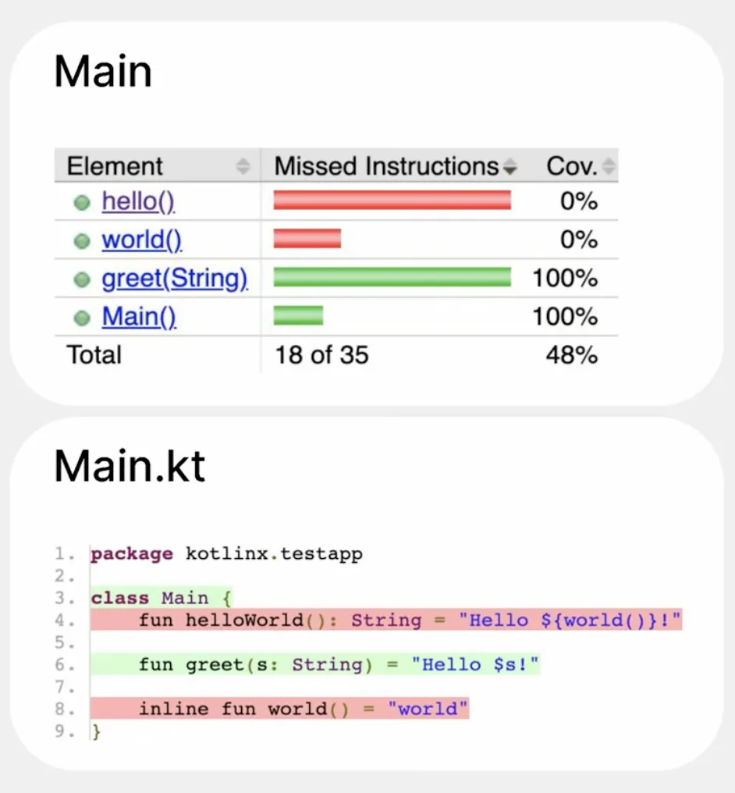

所以KN的这行代码跑没跑到？

## 相关项目

- JaCoCo：https://www.jacoco.org/jacoco/trunk/doc/flow.html
    - java bytecode上插桩；只识别至少执行了一次，不记次数；byte array记录执行情况 + 离线分析
    - 文档声称影响：30% codesize，10%性能
        
- Kover：https://github.com/Kotlin/kotlinx-kover
    - Collection of code coverage through JVM tests (**JS and native targets are not supported yet**).
    - 随kotlin 1.6发布，卖点是更好的KMP集成和对kotlin inline之类的语法做了针对性优化
        - [当前默认agent已经切到了jacoco](https://github.com/Kotlin/kotlinx-kover/issues/720)，更好的kotlin插桩支持后续都会在jacoco的agent中实现，第二个卖点已经没了
- Rust Coverage：https://rustc-dev-guide.rust-lang.org/llvm-coverage-instrumentation.html
    - 基于llvm sourcebased方案
- llvm
    - gcov
        - 基于dwarf，兼容gnu gcc
    - source based
        - clang前端从c代码直接生成mapping信息，不基于dwarf，llvm主推的方式
        - Kotlin 社区[曾实现过](https://github.com/JetBrains/kotlin/commit/4f77434ea57fea4a2f8b49abf9c495447c34f15a)基于source based的覆盖率，因为CoverageMappingFormat格式不稳定升级负担等原因回滚掉了
        - https://llvm.org/docs/CoverageMappingFormat.html
        - https://llvm.org/docs/InstrProfileFormat.html
        - https://clang.llvm.org/docs/SourceBasedCodeCoverage.html
            

## 技术选型

基于什么，哪里动刀

1. 红色：发明部分轮子，Kotlin IR上插桩
   - 优点
     - KMP所有后端，jvm/wasm/js/native 可以共用一套工具
     - 插桩位置更靠近 Kotlin 代码，覆盖率和源码的对应关系更好
   - 缺点
     - 需要进行 Control Flow Graph 分析（KN编译器中已有），插桩策略（参考jacoco）+实现（KCP，难度较大），进行离线结果分析/源码对应（考虑复用jacoco组件）
2. 绿色：llvm gcov，LLVM IR上插桩，dwarf对应到源码
   - 优点
     - 成熟的native profile工具，接入简单
   - 缺点
     - LLVM IR 离 Kotlin 代码更远，已经经过了一些处理，如 Kotlin IR 上的的inline，一些高级语法难以对应到源码
3. 蓝色+绿色：llvm sourcebased，LLVM IR上插桩，CoverageMapping对应到源码
   - 优点
     - 成熟的native profile工具
     - 源码对应关系是和dwarf独立的另一套数据，便于针对 Kotlin 语法进行调整
   - 缺点
     - 需要实现根据 Kotlin IR 给 LLVM IR 添加 __llvm_coverage_mapping ，工作量大，升级 LLVM 复杂
        
        https://excalidraw.com/#json=aaQDMU02N7k53sisqFP_Z,HG6qXqnoE3cvnF9dwZHk1Q

- Kover作为JB专门为KMP开发的框架也没做到Kotlin IR上，Kotlin IR上实现难度应该较高
- LLVM gcov可以只根据dwarf信息解析到代码，sourcebased实现需要在Konan前端加Code Coverage Map生成，成本较高
- 综上选择 gcov 看看效果

## KN 接入 LLVM gcov

参考实现：https://github.com/linhandev/KuiklyBase-kotlin/commits/gcov/ 分支最后一笔，KN工程中添加两个编译选项

```
freeCompilerArgs += "-Xadd-light-debug=enable"
freeCompilerArgs += "-Xbinary=coverage=true"
```

## LLVM gcov 原理

以C代码为例

```cpp
#include <stdlib.h>

int main() {
    bool isOdd;
    if (rand() % 3 == 0) {
        isOdd = true;
    } else {
        isOdd = false;
    }
    return 0;
}
```

### LLVM IR插桩

首先在llvm ir上运行 GCOVProfilerPass，插桩前

```llvm
define dso_local i32 @main() #0 {
  %1 = alloca i32, align 4
  %2 = alloca i8, align 1
  store i32 0, i32* %1, align 4
  %3 = call i32 @rand()
  %4 = srem i32 %3, 2
  %5 = icmp eq i32 %4, 0
  br i1 %5, label %6, label %7

6:
  store i8 1, i8* %2, align 1
  br label %8

7:
  store i8 0, i8* %2, align 1
  br label %8

8:
  ret i32 0
}
```

插桩后

```llvm
@__llvm_gcov_ctr = internal global [2 x i64] zeroinitializer

... ...

; Function Attrs: noinline norecurse optnone mustprogress
define dso_local i32 @main() #0 {
  %1 = alloca i32, align 4
  %2 = alloca i8, align 1
  store i32 0, i32* %1, align 4
  %3 = call i32 @rand()
  %4 = srem i32 %3, 2
  %5 = icmp eq i32 %4, 0
  br i1 %5, label %6, label %9

6:                                                ; preds = %0
  %7 = load i64, i64* getelementptr inbounds ([2 x i64], [2 x i64]* @__llvm_gcov_ctr, i64 0, i64 0), align 8
  %8 = add i64 %7, 1
  store i64 %8, i64* getelementptr inbounds ([2 x i64], [2 x i64]* @__llvm_gcov_ctr, i64 0, i64 0), align 8
  store i8 1, i8* %2, align 1
  br label %12

9:                                                ; preds = %0
  %10 = load i64, i64* getelementptr inbounds ([2 x i64], [2 x i64]* @__llvm_gcov_ctr, i64 0, i64 1), align 8
  %11 = add i64 %10, 1
  store i64 %11, i64* getelementptr inbounds ([2 x i64], [2 x i64]* @__llvm_gcov_ctr, i64 0, i64 1), align 8
  store i8 0, i8* %2, align 1
  br label %12

12:                                               ; preds = %9, %6
  ret i32 0
}

```

IR中多了一个@__llvm_gcov_ctr数组，包含两个int64，分别统计走if和走else bb的次数

### 链接runtime

链接 libclang_rt.profile.a，应当优先使用跟插桩pass同一个LLVM版本中的静态库。腾讯的LLVM 12没打出这个a，用DevEco里15的静态库版本是错配的，但是这种混搭使用中还没发现问题。PGO的runtime也在这个a里（_*llvm_profile**），做覆盖率统计主要就用到统计结果写盘相关的实现

```cpp
T __gcov_dump # 手动触发结果写盘
T __gcov_fork
T __gcov_reset # 重置内存中的结果
```

### hap集成

在合适的时机触发dump

```cpp
extern "C" void __gcov_dump(void) __attribute__((weak));

if (__gcov_dump) {
    __gcov_dump();
}
```

要写到有权限的沙箱路径
- GCOV_PREFIX=有权限的路径
- GCOV_PREFIX_STRIP=99 去除所有前缀，在设置的路径平铺，⚠️ 可能导致碰撞
    - \-\-hash-filenames 在文件名中添加hash
    - 设好dwarf信息后减少strip的前缀数量

## 覆盖率解析

- gcno：coverage note，Control Flow Graph和代码的对应关系，只有代码的绝对路径位置没有代码内容
- gcda：coverage data，运行时CFG中每条边的执行次数

注意：
- 理论上有这俩就能解出来每行有没有执行，实际一些工具在设计上一定要求提供代码，没有代码时推荐lcov
- 上面那笔参考实现 gcno 是写到执行 gradlew 命令时的当前目录，gcda 是写到 /data/app/el2/100/base/[bundle名]/files/gcov/。电脑上使用 `hdc file recv [手机路径] [电脑路径]` 将gcda下载到电脑上
- exe/so中链接插了覆盖率桩的静态库，打静态库时就会出gcno，链接一个这样的库就会多生成一个gcda。ie：有几个gcno就会有几个gcda，一一对应
- 运行多次程序，一个gcno可以对应多个gcda；但是不会有一个gcda对应多个gcno，有几个gcno一次运行就会生成几个gcda

### llvm-cov

llvm自带工具，输出格式不是很好看/进行后续处理，不太推荐用这个

解析时把gcno和gcda放在一个文件夹，要求盘上在打包时原位置有代码

```shell
ls
# libc2k.gcda libc2k.gcno
gcov -b -f libc2k.gcda
```

部分输出，包含行/分支/函数覆盖，其中
- \-: 代表不认为这一行是代码，如注释，label等
- #####: 代表认为这行是代码，而且没有被执行
- 数字代表统计到这行执行了多少次
- branch x taken 统计分支覆盖率

```
        -:    0:Source:/Users/hl/git/sample/kn_samples/switchLib/src/commonMain/kotlin/SwitchFunction.kt
        -:    0:Graph:libc2k.gcno
        -:    0:Data:libc2k.gcda
        -:    0:Runs:1
        -:    0:Programs:1
        -:    1:package com.example.switchlib
        -:    2:
function kfun:com.example.switchlib#processValue(){}kotlin.String called 1 returned 100% blocks executed 56%
        2:    3:fun processValue(): String {
        -:    4:    val value = 3
        -:    5:    return when (value) {
        1:    6:        1 -> "One"
branch  0 taken 0%
branch  1 taken 100%
        1:    7:        2 -> "Two"
branch  0 taken 0%
branch  1 taken 100%
        1:    8:        3 -> "Three"
branch  0 taken 100%
branch  1 taken 0%
    #####:    9:        3 -> "Three again"
branch  0 never executed
branch  1 never executed
    #####:   10:        5 -> "Five"
branch  0 never executed
branch  1 never executed
    #####:   11:        else -> "Other"
        1:   12:    }
        1:   13:}
        -:   14:
function kfun:com.example.switchlib#processValueCond(){}kotlin.String called 1 returned 100% blocks executed 56%
        2:   15:fun processValueCond(): String {
        -:   16:    val value = 3
        -:   17:    return when {
        1:   18:        value == 1 -> "One"
branch  0 taken 0%
branch  1 taken 100%
        1:   19:        value == 2 -> "Two"
branch  0 taken 0%
branch  1 taken 100%
        1:   20:        value == 3 -> "Three"
branch  0 taken 100%
branch  1 taken 0%
    #####:   21:        value == 3 -> "Three again"
branch  0 never executed
branch  1 never executed
    #####:   22:        value == 5 -> "Five"
branch  0 never executed
branch  1 never executed
    #####:   23:        else -> "Other"
        1:   24:    }
        1:   25:}
```

### gcovr

[gcovr](https://github.com/gcovr/gcovr)基于gcov，支持的输出格式比较多，html格式看起来比较方便，json报告后续接处理流程比较方便，跟llvm-cov一样把gcno，gcda放在一个文件夹，要求盘上有代码

html报告，绿色100%执行，黄色有分支被部分执行，红色没执行，白色的是不认为是代码（注释这种）

```bash
python -m gcovr --html --html-details --output out/coverage.html --root [项目源码文件夹] \
  --gcov-ignore-errors=source_not_found \
  --gcov-ignore-errors=output_error \
  --gcov-ignore-errors=no_working_dir_found [包含gcno，gcda文件的路径]
```


json报告中有行/分支/函数覆盖率

```shell
python -m gcovr --json --root [项目源码文件夹] \
  --gcov-ignore-errors=source_not_found \
  --gcov-ignore-errors=output_error \
  --gcov-ignore-errors=no_working_dir_found [包含gcno，gcda文件的路径]
```

```json
{
    "file": "switchLib/src/commonMain/kotlin/SwitchFunction.kt",
    "lines": [
        {
            "line_number": 3,
            "function_name": "kfun:com.example.switchlib#processValue(){}kotlin.String",
            "count": 2,
            "branches": [],
            "gcovr/md5": "81015be1cd4ce43c21880ee229b5e1f7"
        },
        {
            "line_number": 6,
            "function_name": "kfun:com.example.switchlib#processValue(){}kotlin.String",
            "count": 1,
            "branches": [
                {
                    "branchno": 0,
                    "count": 0,
                    "fallthrough": false,
                    "throw": false,
                    "source_block_id": 0
                },
                {
                    "branchno": 1,
                    "count": 1,
                    "fallthrough": false,
                    "throw": false,
                    "source_block_id": 0
                }
            ],
            "gcovr/md5": "9198419fd3b61d1b13355cc8c716c729"
        },
        {
            "line_number": 7,
            "function_name": "kfun:com.example.switchlib#processValue(){}kotlin.String",
            "count": 1,
            "branches": [
                {
                    "branchno": 0,
                    "count": 0,
                    "fallthrough": false,
                    "throw": false,
                    "source_block_id": 0
                },
                {
                    "branchno": 1,
                    "count": 1,
                    "fallthrough": false,
                    "throw": false,
                    "source_block_id": 0
                }
            ],
            "gcovr/md5": "8a04fefbaaf29f7620e152b5629ee660"
        },
        {
            "line_number": 8,
            "function_name": "kfun:com.example.switchlib#processValue(){}kotlin.String",
            "count": 1,
            "branches": [
                {
                    "branchno": 0,
                    "count": 1,
                    "fallthrough": false,
                    "throw": false,
                    "source_block_id": 0
                },
                {
                    "branchno": 1,
                    "count": 0,
                    "fallthrough": false,
                    "throw": false,
                    "source_block_id": 0
                }
            ],
            "gcovr/md5": "a63ff6c3b1086e8e98c4ee7f3815c643"
        },
        {
            "line_number": 9,
            "function_name": "kfun:com.example.switchlib#processValue(){}kotlin.String",
            "count": 0,
            "branches": [
                {
                    "branchno": 0,
                    "count": 0,
                    "fallthrough": false,
                    "throw": false,
                    "source_block_id": 0
                },
                {
                    "branchno": 1,
                    "count": 0,
                    "fallthrough": false,
                    "throw": false,
                    "source_block_id": 0
                }
            ],
            "gcovr/md5": "08b111aa51c291b9037756035641d8cc"
        },
        ... ...
    ],
    "functions": [
        {
            "demangled_name": "kfun:com.example.switchlib#processValue(){}kotlin.String",
            "lineno": 3,
            "execution_count": 1,
            "blocks_percent": 56.0
        },
        {
            "demangled_name": "kfun:com.example.switchlib#processValueCond(){}kotlin.String",
            "lineno": 15,
            "execution_count": 1,
            "blocks_percent": 56.0
        }
    ]
}
```

### lcov

lcov主要在gcov的基础上扩展了报告展示和运行数据合并，不要求盘上有代码

```
lcov --gcov-tool /tmp/llvm_cov_wrapper.sh \
     --ignore-errors format,empty,inconsistent \
     --function-coverage \
     --branch-coverage \
     --capture \
     --directory . \
     --output-file coverage.info
```
- \-\-gcov-tool：指定gcov工具路径，建议跟插桩用同一个llvm，使用llvm工具链gcov不是一个exe，是llvm-cov下的一个模式，这个选项可以传一个脚本，内容 `/path/to/llvm-cov gcov "$@"`
- \-\-capture：从 --directory 下找所有gcda和gcno数据进行解析

结果中
- SF：Source File，源码路径
- FNL：Function Line，函数0在第15行定义
- FNA：Function Name，函数0，checksum 1，函数符号名 kfun:com.example.switchlib#processValueCond(){}kotlin.String
- FNF：Functions Found，共发现2个函数
- FNH：Functions Hit，共执行2个函数
- BRDA：Branch Data，第6行，第0组（一组就是一个分支），分支1，执行1次
- BRF：Branches Found，共发现20个分支
- BRH：Branch Hit，覆盖了其中6个
- DA：Data，行号:执行次数
- LF：Lines Found，共发现18行代码
- LH：Lines Hit，共覆盖其中12行

```
TN:
SF:/Users/hl/git/sample/kn_samples/switchLib/src/commonMain/kotlin/SwitchFunction.kt
FNL:0,15
FNA:0,1,kfun:com.example.switchlib#processValueCond(){}kotlin.String
FNL:1,3
FNA:1,1,kfun:com.example.switchlib#processValue(){}kotlin.String
FNF:2
FNH:2
BRDA:6,0,0,0
BRDA:6,0,1,1
BRDA:7,0,0,0
BRDA:7,0,1,1
BRDA:8,0,0,1
BRDA:8,0,1,0
BRDA:9,0,0,-
BRDA:9,0,1,-
BRDA:10,0,0,-
BRDA:10,0,1,-
BRDA:18,0,0,0
BRDA:18,0,1,1
BRDA:19,0,0,0
BRDA:19,0,1,1
BRDA:20,0,0,1
BRDA:20,0,1,0
BRDA:21,0,0,-
BRDA:21,0,1,-
BRDA:22,0,0,-
BRDA:22,0,1,-
BRF:20
BRH:6
DA:3,2
DA:6,1
DA:7,1
DA:8,1
DA:9,0
DA:10,0
DA:11,0
DA:12,1
DA:13,1
DA:15,2
DA:18,1
DA:19,1
DA:20,1
DA:21,0
DA:22,0
DA:23,0
DA:24,1
DA:25,1
LF:18
LH:12
end_of_record
```

lcov合并多次执行的报告

```
lcov --add-tracefile coverage.info \
     --add-tracefile coverage.info \
     --ignore-errors format,inconsistent \
     --function-coverage \
     --branch-coverage \
     --output-file coverage_merged.info
```

一波解析多次运行的覆盖率，生成合并的报告。其中两个run文件夹里都要同时包含gcno，gcda

```
tree .
.
├── coverage.info
├── run1
│   ├── libc2k.gcda
│   └── libc2k.gcno
└── run2
    ├── libc2k.gcda
    └── libc2k.gcno

lcov --gcov-tool /tmp/llvm_cov_wrapper.sh \
     --ignore-errors format,empty,inconsistent \
     --function-coverage \
     --branch-coverage \
     --capture \
     --directory run1/ \
     --directory run2/ \
     --output-file coverage.info
```

如果两次运行的程序完全一样，gcno完全一样，可以用一个gcno+多个gcda生成合并报告

```
tree .

.
├── coverage.info
├── libc2k.gcno
├── run1
│   └── libc2k.gcda
├── run2
│   └── libc2k.gcda
└── run3
    └── libc2k.gcda

lcov --gcov-tool /tmp/llvm_cov_wrapper.sh \
    --ignore-errors format,empty,inconsistent \
    --function-coverage \
    --branch-coverage \
    --capture \
    --build-directory . \
    --directory run1 \
    --directory run2 \
    --directory run3 \
    --output-file coverage.info
```

## edge case

- inline
  https://youtu.be/jNu5LY9HIbw?t=278 （jacoco 24年已经[支持了](https://github.com/jacoco/jacoco/pull/1670)）
  

- 异常

- lambda

- chained call

## TODO
- 是否可以控制插桩代码的范围
- 补全edge case，分析原因，解决方法
