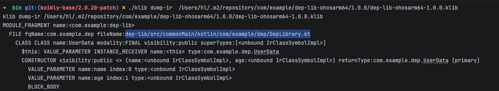
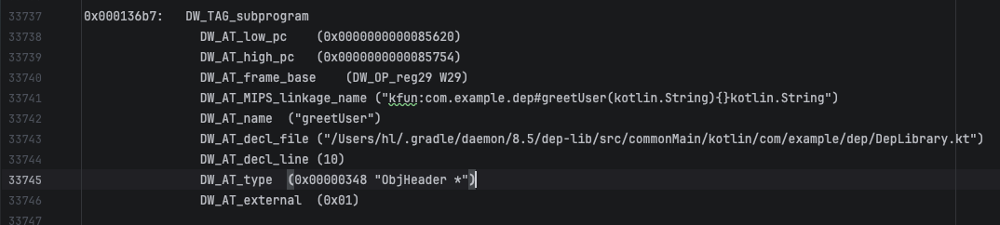
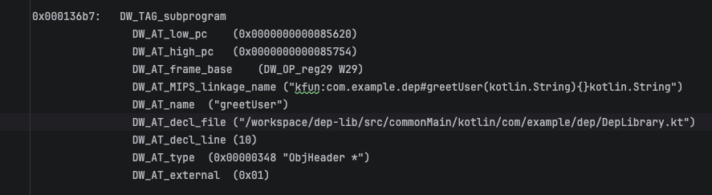

## dwarf中代码文件路径是打包时机器上的绝对路径

这会导致调试时需要设很多mapping才能让流水上打包产物中的文件路径和本地的路径匹配上

-Xdebug-prefix-map

- 用法：-Xdebug-prefix-map=/real/path/prefix/=/virtal/unified/prefix
- 这个选项在后端生效，只需要在顶层出so的gradle子项目中配，在出klib的项目中配没效果
- 可以重复添加map多个路径，如
  ```kotlin
  freeCompilerArgs.add("-Xdebug-prefix-map=/Users/hl/git/sample/kn_samples=/workspace")
  freeCompilerArgs.add("-Xdebug-prefix-map=/Users/hl/git/kmp/=/workspace/")
  ```
- 这个选项相当于是在dwarf信息中查找替换，注意结尾对齐，比如都写 / 或者都不写 /
- 不支持模糊匹配

-Xklib-relative-path-base

- 用法：-Xklib-relative-path-base=${project.rootDir}
- 这个选项在出klib的时候生效
  添加前:
  
  添加后:
  
- 最终的dwarf中仍然是绝对路径，以gradle daemon路径开头，eg：
  
- 当设置的路径不是代码路径的前缀时，这个选项不生效。

结合：
- 出klib的项目使用相对路径
  ```kotlin
  compilerOptions {
      freeCompilerArgs.add("-Xklib-relative-path-base=${project.rootDir}")
  }
  ```
- 出so的项目替换gradle daemon前缀
  ```kotlin
  compilerOptions {
    val gradleUserHome = project.gradle.gradleUserHomeDir.absolutePath
    val gradleVersion = project.gradle.gradleVersion // e.g., "8.5"
    val daemonPath = "$gradleUserHome/daemon/$gradleVersion"

    freeCompilerArgs.add("-Xdebug-prefix-map=$daemonPath=/workspace")
  }
  ```

效果：


进一步：修改KGP参数，在没有设置 -Xklib-relative-path-base 时添加项目根 gradle 项目路径，避免所有sdk中手动设置


